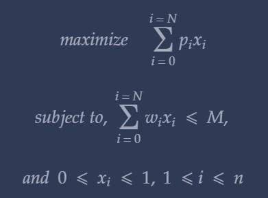

# Knapsack


## What is the Knapsack problem?

 
- A robber wants to steal a house. He carries a sack, AKA Knapsack. The capacity of the Knapsack <mark style="background-color: #2F3B54; color:#A2AABC; border-radius:2px; padding:2px">M kg</mark> . He enters the house and sees <mark style="background-color: #2F3B54; color:#A2AABC; border-radius:2px; padding:2px">N items</mark>
 of mass    `m`<sub>`1`</sub>, `m`<sub>`2`</sub>, `m`<sub>`3`</sub>, `m`<sub>`4`</sub>, `m`<sub>`5`</sub>, `m`<sub>`6`</sub> `...`, `m`<sub>`N`</sub>
 and profit   `p`<sub>`1`</sub>, `p`<sub>`2`</sub>, `p`<sub>`3`</sub>, `p`<sub>`4`</sub>, `p`<sub>`5`</sub>, `p`<sub>`6`</sub> `...`, `p`<sub>`N`</sub>

<strong> Help the robber make the most profit by helping him decide what items to put in the bag. </strong> 

<hr>

Essentially we are trying to,

<center>  



</center>

<hr>

There are **3** ways to solve this.

- Ordered by Profit (Highest to Lowest)
- Ordered by Weight (Lowest to Highest)
- ``` Ordered by Profit to Weight ```

Methods 1 & 2 aren't optimal always. Method 3 is the most optimal

Here is the algorithm:

```
Step 1: Sort the arrays on the basis of Profit By Weight Ratio

Step 2: Initialize array X to all 0. X[i] will be 1 or 0 in case of 1/0 Knapsack* or 0 <= X[i] <= 1 in case of Fractional Knapsack**

Step 3: Initialize variable remainingCapacity = M (integer or float depending on what is the type of Knapsack)

Step 4: for(i = 0; i < N; i++)
            if(weight[i] > remainingCapacity)
                break;
            X[i] = 0;
            remainingCapacity = remainingCapacity - weight[i];
        
Step 5: if(i <= n)
            X[i] = U/weight[i];
```


- Fractional Knapsack: The case in which we are allowed to break the item

- 1/0 Knapsack: The case in which we have to either take the whole item or reject it completely.


